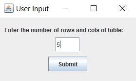
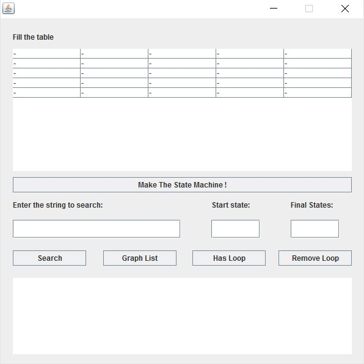
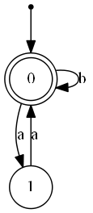

[FSM](https://github.com/aminrashidbeigi/FSM.git)
=
FSM is my data structure course final project. 
You can download persian manual in [manual](manual/) folder.

Technologies
-

- Java
- [GraphViz](http://www.graphviz.org/)

Short Manual
-
First of all, program get the input from user :
 

  

After that, program creates an empty transition
table and user fills it:

  

Just push the "Make The State Machine!" button. now 
your state machine is ready to find input string in the finite state machin. 
You can also find out it state machine has loop and if has it, remove loop(s).
After that, program creates a .PNG file of your state machine, using [GraphViz](http://www.graphviz.org/) like this :

  

